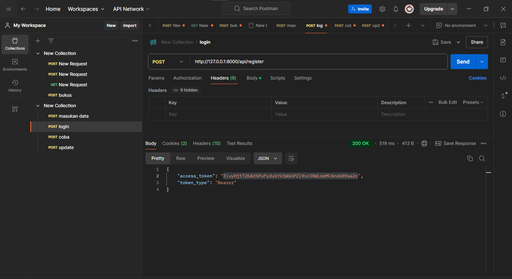

<h1>code</h1>

code dari database

code dari auth untuk mengaktivasi login dan register

code dari kernel untuk emnghubungkan api

controller dari siswa

menambahkan filabel baru pada siswa

code dari route api

<h1>hasil</h1>

membuat data baru pada register yang memasukan nama email dan password

menguji login dan mendapatkan token nya 

memasukan data dari siswa dengn format nama umur dan kelas

hasil dari memasukan data

mengupdate data nya 

setelah di update

membuat get untuk menampilkan semua data

hasil dari validasi dari yang sudah di terapkan

delete untuk data siswa

